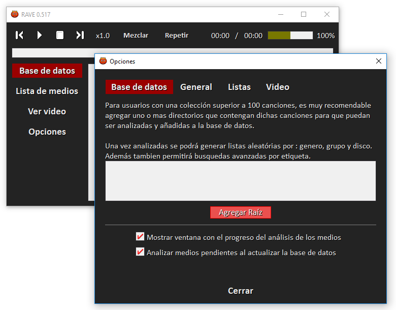
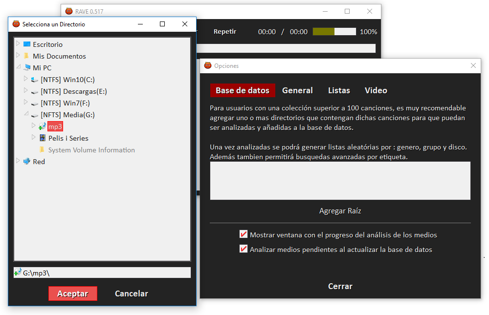
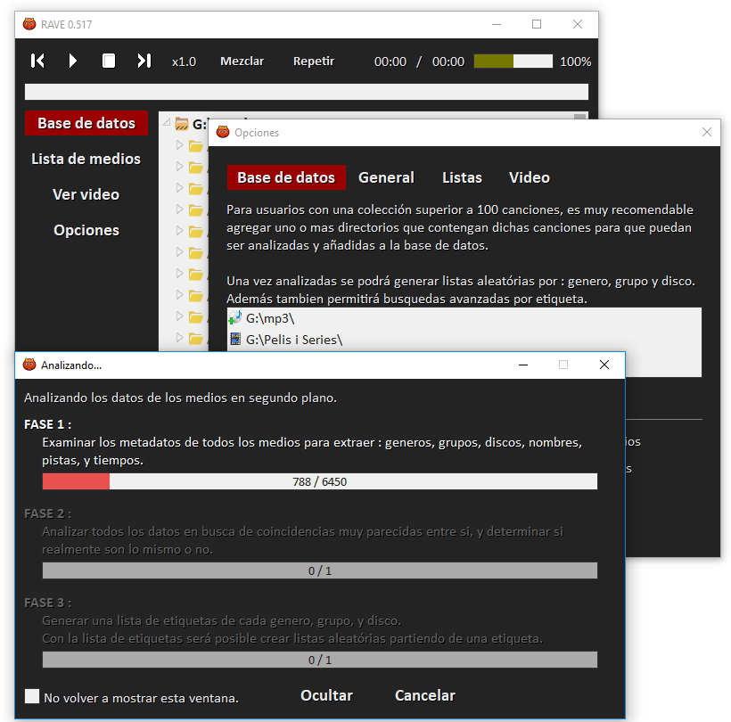
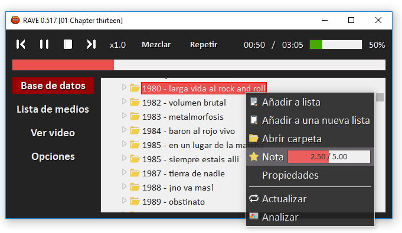
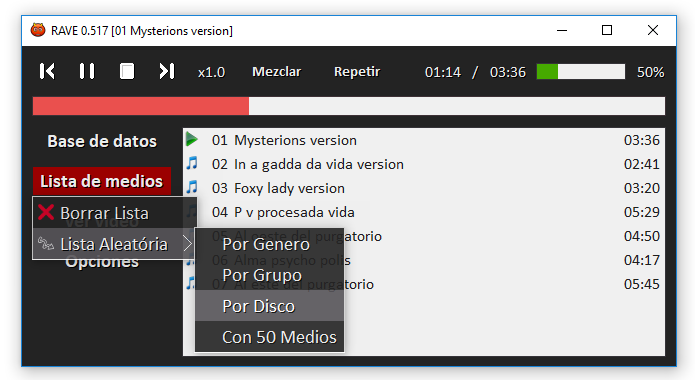
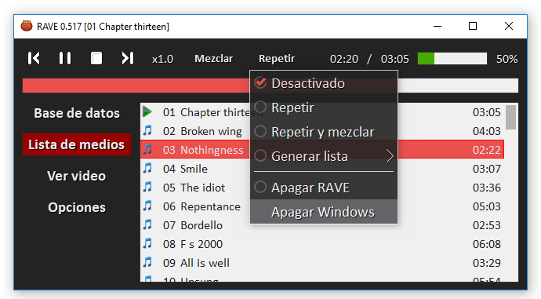

# Reproductor de Audio y Video Extendido
Reproductor de Audio y Video bajo windows basado en la [LibVlc](https://www.videolan.org/vlc/index.es.html) con una base de datos [SQLite](https://www.sqlite.org/).

Todo lo que necesito para mi uso personal : 
 * Listas de música aleatórias nada mas empezar.

 * Apagado del ordenador al terminar una lista. 

 * Personalización de valores para cada video (brillo, saturacion, contraste, proporción, etc...)

 * Barra de controles vertical en videos (para ver bien los subtitulos al mover el mouse)

### Requisitos
Sistema operativo Windows 7 o superior (x86. x64)

### Log de cambios
* [Ultima versión 0.526j RC6](https://github.com/devildrey33/RAVE/blob/master/ChangeLog.md)

## Empezando
 1. Descarga una de las siguientes versiones para windows : 
   * [RAVE x86 para 32 bits](http://devildrey33.github.io/RAVE/Instaladores/Instalador%20x86/SetupRave-x86.msi) 
   * [RAVE x64 para 64 bits](http://devildrey33.github.io/RAVE/Instaladores/Instalador%20x64/SetupRave-x64.msi)
 
 2. Instala y ejecuta el reproductor, luego abre la ventana de opciones.
 
 
 
 3. Pulsa en 'Agregar Raíz' y selecciona una carpeta de tu ordenador que contenga una colección de música o vídeo (Por ejemplo C:\MP3, C:\Series, etc...), puede ser incluso un disco externo o de red que no este siempre disponible (en caso de no disponibilidad se omitirá).
 
 
 
 4. Repite el paso 3 todas las veces que sea necesario, y al terminar pulsa el boton 'Cerrar'. Veras una ventana que muestra el proceso del análisis de los medios, una vez terminado ya podrás crear listas aleatórias pulsando la tecla 'Insert'.
 
 

 
### Propósito
 * Reproductor diseñado para gestionar agilmente una amplia colección de música y vídeo utilizando su propia base de datos.
 > Al tener todo registrado en una base de datos interna, puedo generar listas aleatórias agilmente, e incluso generar listas de canciones mas escuchadas.
 
 > Tambien preservara los valores del brillo, contraste, saturación, proporción establecidos expresamente para cada video.
  
 > Al reproducir un medio completamente se le sumará una nota de 0.05 de forma que si todos los medios parten de una nota de 2.5, y al reproducir-los 50 veces llegaran a una nota de 5.0. Por supuesto tienes la posibilidad de modificar la nota de cualquier medio o incluso de un grupo de medios a la vez.
 
 
 
 * Poder generar listas de música aleatória según las preferencias establecidas.
 > Con una sola tecla puedo generar una lista de canciones aleatória, que puede ser por genero, por grupo, por disco, o aleatória totalmente (Por defecto es la tecla 'Insert').
 
 > Tambien puedo pulsar el boton 'Lista de medios' con el boton derecho del mouse y crear una lista personalizada.

 

 * Capacidad de apagar el reproductor / ordenador al terminar la lista de medios.
 > Asi puedo reproducir un par o tres de mis capitulos favoritos al meterme en la cama, y que el ordenador se apague al finalizar la lista.
 
 
 
### Teclado por defecto
Teclas por defecto cuando el reproductor tiene le foco del teclado (excepto si el foco lo tiene una caja de edición de texto)

 Combinación de teclas       | Acción
---------------------------- | ----------------------------
*Espacio*                    | `play / pausa`
*Insert*                     | `Generar lista aleatória`
*+*                          | `Subir volumen`
*-*                          | `Bajar volumen`
*Control + Cursor derecha*   | `Reproducir siguiente` 
*Control + Cursor izquierda* | `Reproducir anterior`
*F1*                         | 'Mostrar info del medio actual'
*F2*                         | 'Mostrar medio actual en la BD'
*F3*                         | 'Mostrar medio actual en la lista'

### FAQ
 * Que es una raíz?
 
 > Una raíz es un direcotrio 'padre' desde el que el reproductor buscara medios que se puedan reproducir. Puedes añadir mas de una raíz al reproductor, pero aunque es posible... no se recomienda agregar unidades de disco directamente como una raíz.
  
 * Si agrego o elimino medios de una raíz, es necesario actualizar la base de datos? 
 
 > Si tienes el reproductor encendido mientras has realizado dichos cambios, debes desplegar el menú de la base de datos, y pulsar actualizar.

 > Si no tienes el reproductor encendido, no te preocupes ya que la próxima vez que se inicie re-escaneara la raíz automáticamente para cerciorarse de que todos los medios existen, y de paso para detectar nuevos medios.
 
 * He actualizado el reproductor desde una versión 0.516+ a la 0.6x y da un error crítico aleatóriamente...

 > Esto puede ser debido a que la base de datos ha sido actualizada varias veces durante las versiones 0.516+, y la versión 0.6 solo es capaz de actualizar la base de datos de la versión 0.500 (ya que las versiones entre medio no se consideran estables). Para solucionar el problema debes borrar la base de datos, que está ubicada en : "C:\ProgramData\RAVE\Rave_x??.BD". 

 > Si el problema persiste, no olvides enviar el informe de errores para que pueda ser analizado y solucionado en futuras versiones.


 ### Notas para compilar el proyecto

 * Todo lo necesario para compilar y ejecutar la LibVLC y SQLite vienen en este repositorio.
 
 * Hace falta la [DWL3](https://github.com/devildrey33/DWL3) Devildrey33 Windows Library. Para ir bien deberías crear un directorio RAVE para el código del reproductor y un directorio DWL3 para la librería, ambos en tu directorio de proyectos. El proyecto está configurado para buscar la DWL en "..\DWL3"

 * Debes crear un archivo llamado "RAVE_CuentaEmail.h" dentro de la carpeta "Reproductor de Audio y Video Extendido" y añadir lo siguiente : 
 ```c++
#pragma once

#define EMAIL_SMTP      ""	// SMTP
#define EMAIL_DESTINO   ""	// Email destino para enviar los dumps
#define EMAIL_ORIGEN    ""	// Email origen desde donse se mandan los dumps
#define EMAIL_LOGIN     ""	// Login
#define EMAIL_PASS      ""	// Password
 ```

 * Si consigues compilar el proyecto pero al ejecutar da un error que no se encuentra la libvlc.dll, debes hacer lo siguiente :
	* Abre las propiedades del Reproductor de Audio y Video Extendido en el explorador de soluciones.
	* Ve a "Depuración" -> "Directorio de trabajo" y extablece el valor a "..\Release-x86" o "..\Release-x64" según sea la configuración de 32 o 64 bits.